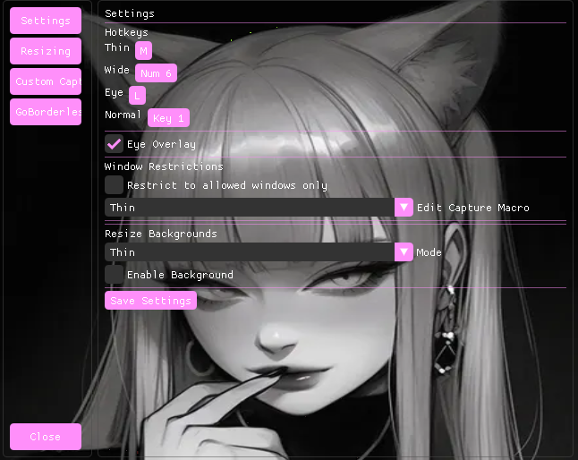

# Externa

Externa is a tool for Minecraft Speedrunning which acts fully externally, resizes Minecraft and shows overlays.

A special thanks to Flammable Bunny for fixing my eye zoom !!!!
Dear ImGui by Omar Cornut.
nlohmann/json by Niels Lohmann.

## Externa features:
- resize macros
- screen mirrors
- custom backgrounds per resize

## Externa functionality:
Creates an overlay and sets the owner of the overlay to be Minecraft for displaying stuff.
The background has a cutout of Minecraft so you can still see Minecraft

All of this happens externally – no code is injected into Minecraft. The overlay is just another window that Windows places on top of the game, and ImGui does the actual drawing.

